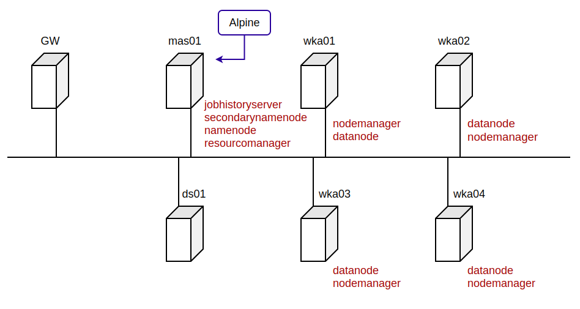

# DT

#YI-CHEN
#AB

-------------- python

* 產生 SSH 公私鑰

`ssh-keygen -t rsa -P ` 

* 複製公鑰至各台電腦

`ssh-copy-id Name@Hosts`

$ `ssh-copy-id bigred@192.168.10.10`

dt sysinfo

dt sysprep

dt build

starthdfs

stophdfs

startyarn

--------------

